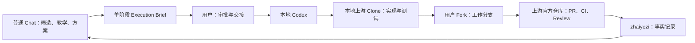

# 摘叶子

以真实开源 Issue 为入口，由普通 Chat 负责教学与方案整理、本地 Codex 负责阶段化工程执行，并把过程沉淀为可查询的学习记录。

## 工作原则

- 事实、推断和测试证据分开记录。
- 先理解 Issue 和代码路径，再设计与实现。
- 普通 Chat 每个阶段生成一次 `Execution Brief`；Codex 只执行简报中的工程范围。
- 每个关键改动都说明为什么这样做。
- 未经确认，不执行公开留言、认领、推送或创建 PR。
- 无论合入、阻塞还是放弃，都记录结果和原因。
- 默认不使用子 Agent，记录只更新本阶段发生变化的内容。

研究链路按需采用：

```text
Knowledge
→ Inventory
→ Code Map / Lifecycle
→ Analysis
→ Plan
→ Implementation
→ Testing
→ Review / Outcome
```

`KNOWLEDGE.md` 帮助新读者理解必要背景，Inventory 防止局部样本造成范围误判，`CODE-MAP.md` 保存源码组织与运行事实，`ANALYSIS.md` 才负责基于证据推理。并非每个 Issue 都需要同等深度：没有关键领域门槛时可以保持 Knowledge 简短，不涉及集合或扩展对象时不必建立 Inventory，没有多阶段传播时也不必单列 Lifecycle。

## 公开沟通

```text
Research
    ↓
Draft
    ↓
Chat Review
    ↓
User Approval
    ↓
Publication
```

Issue 评论、回复、PR、Review、Discussion、RFC 以及会出现在 GitHub 上的 Commit 信息，最终都代表用户本人。普通 Chat 负责技术 Review 和润色，用户决定是否公开，Codex 只在明确授权后执行发布。完成 Draft 不等于获得发布权限；默认可以按简报准备草稿，默认禁止发布。

## 协作闭环



- 普通 Chat：筛选候选、教学、比较方案并决定下一阶段。
- 本地 Codex：按简报执行代码调查、实现、测试和发布。
- GitHub 事实仓库：保存双方可共享的状态、决策和证据。
- 用户：批准外部操作并触发两个 Agent 之间的交接。

> 普通 Chat 只能读取已经推送到 GitHub 的结果；Codex 本地未推送的状态不会自动同步到 Chat。

## 仓库角色

- `Yanansn/zhaiyezi`：事实和交接仓库，保存状态、决策、证据与学习记录。
- 上游官方仓库：Issue、PR、CI、Review 和最终合入的实时权威来源。
- 用户 Fork：上游代码工作分支和 Commit 的 Push 位置。
- 本地上游 Clone：Codex 读取、修改、编译、测试和提交真实代码的工作区。

> 上游项目的真实代码修改和 Commit 不进入 `zhaiyezi`；`zhaiyezi` 只保存已核验的状态、决策、证据和交接记录。

工程贡献流为：`Chat 筛选和决策 → Execution Brief → Codex 操作本地上游 Clone → Commit 到工作分支 → Push 到用户 Fork → 创建上游 PR → 更新 zhaiyezi → Chat 重新读取并处理下一阶段`。

PR 属于状态模型的一部分：`testing → pr-ready → submitted → reviewing → merged/closed/rejected/blocked/superseded`。

## 当前任务

参见 `registry/issues.yaml` 和各 Issue 目录中的 `STATUS.yaml`。

新上下文或新 Agent 应先读取 `AGENTS.md` 和 `HANDOFF.md`，再核验 GitHub 实时状态。

详细规则见 [AGENTS.md](AGENTS.md)，当前状态见 [HANDOFF.md](HANDOFF.md)，Ubuntu 操作见 [LOCAL-TAKEOVER.md](LOCAL-TAKEOVER.md)，阶段交接使用 [Execution Brief 模板](.agents/skills/harvest-open-source-issue/references/execution-brief.md)。

## 状态流转

`candidate → screening → awaiting-triage/selected → analyzing → planned → implementing → testing → pr-ready → submitted → reviewing → merged/closed/blocked/rejected/superseded`
