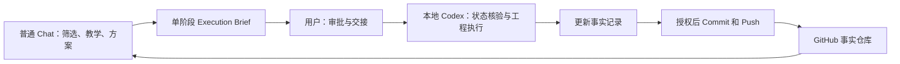

# 摘叶子

以真实开源 Issue 为入口，由普通 Chat 负责教学与方案整理、本地 Codex 负责阶段化工程执行，并把过程沉淀为可查询的学习记录。

## 工作原则

- 事实、推断和测试证据分开记录。
- 先理解 Issue 和代码路径，再设计与实现。
- 普通 Chat 每个阶段生成一次 `Execution Brief`；Codex 只执行简报中的工程范围。
- 每个关键改动都说明为什么这样做。
- 未经确认，不执行公开留言、认领、推送或创建 PR。
- 无论合入、阻塞还是放弃，都记录结果和原因。
- 默认不使用子 Agent，记录只更新本阶段发生变化的内容。

## 协作闭环

- 普通 Chat：筛选候选、教学、比较方案并决定下一阶段。
- 本地 Codex：按简报执行代码调查、实现、测试和发布。
- GitHub 事实仓库：保存双方可共享的状态、决策和证据。
- 用户：批准外部操作并触发两个 Agent 之间的交接。

> 普通 Chat 只能读取已经推送到 GitHub 的结果；Codex 本地未推送的状态不会自动同步到 Chat。

## 当前任务

参见 `registry/issues.yaml` 和各 Issue 目录中的 `STATUS.yaml`。

新上下文或新 Agent 应先读取 `AGENTS.md` 和 `HANDOFF.md`，再核验 GitHub 实时状态。

详细规则见 [AGENTS.md](AGENTS.md)，当前状态见 [HANDOFF.md](HANDOFF.md)，Ubuntu 操作见 [LOCAL-TAKEOVER.md](LOCAL-TAKEOVER.md)，阶段交接使用 [Execution Brief 模板](.agents/skills/harvest-open-source-issue/references/execution-brief.md)。

## 状态流转

`candidate → screening → awaiting-triage/selected → analyzing → planned → implementing → testing → pr-ready → submitted → reviewing → merged/closed/blocked/rejected/superseded`
