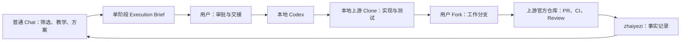

# 摘叶子

以真实开源 Issue 为入口的 **repository-agnostic open source contribution operating system**：由普通 Chat 负责决策与 Review、本地 Codex 负责阶段化工程执行，仓库负责共享记忆、任务队列和证据存储。Kubernetes 只是一个 ecosystem Profile，不是系统默认假设；同一契约可用于 Kubernetes、LMCache、vLLM、SGLang、Dynamo 和其他 GitHub 项目。

## 工作原则

- 事实、推断和测试证据分开记录。
- 先理解 Issue 和代码路径，再设计与实现。
- 普通 Chat 每个阶段生成一次 `Execution Brief`；Codex 只执行简报中的工程范围。
- 每个关键改动都说明为什么这样做。
- 未经确认，不执行公开留言、认领、推送或创建 PR。
- 无论合入、阻塞还是放弃，都记录结果和原因。
- 默认不使用子 Agent，记录只更新本阶段发生变化的内容。

## Agent Coordination Layer

Chat 与 Codex 的跨会话交接通过仓库中的 [agent-protocol](agent-protocol/README.md) 和 `agent-work/` 完成：

```text
Chat REQUEST.yaml
→ Codex RESULT.yaml + REPORT.md + evidence
→ Chat REVIEW.yaml
→ user APPROVAL.yaml（仅受保护动作需要）
```

真实任务固定保存在 `agent-work/tasks/<task-id>/`，目录不移动；队列状态由上述 Artifact 推导。Chat 是 `decision-agent`，负责 Deep Audit、贡献决策、任务和 Review；Codex 是 `execution-agent`，负责 Evidence Collection、代码分析、实现、测试和执行报告。队列协议是现有 Screening 与 Harvest 的外层协调机制，不会把 Evidence 自动升级为 Admission。

```bash
python3 scripts/validate_agent_protocol.py
python3 scripts/agent_queue.py list
python3 scripts/agent_queue.py list --agent codex --status ready
python3 scripts/agent_queue.py next --agent codex
python3 scripts/agent_queue.py show --task <task-id>
```

示例位于 `agent-protocol/examples/`，单独校验且不会进入真实队列。用户可选择在 `decisions/authorizations/` 建立限于 `Yanansn/zhaiyezi`、`main`、actor/action/path 的 standing authorization，使 facts repository 的 Commit/Push 无需逐项授权；示例模板本身不构成授权，没有真实有效文件时仍 default deny。Registry、正式 Issue 初始化、上游 fetch/code/write/branch Push 以及 Issue、评论、认领、标签、PR 等公开动作永远需要单独批准。

候选筛选、Issue 研究与贡献链路：

```text
Repository Onboarding
→ Candidate Discovery
→ Evidence Collection
→ Deep Audit
→ Candidate Admission Gate
→ Project Discovery
→ Code Map
→ Root Cause
→ Confirmed Implementation Boundary
→ Implementation
→ Layered Verification
→ PR
```

`.agents/skills/screen-open-source-issue/` 负责在有限范围内发现和严格审计候选，结果以轻量记录保存在 `screenings/`；被排除或观察中的候选不建立完整 Issue 目录。Stage 2 的 `quick_filtered_out` 只保存低成本元数据排除，不产生筛选分类；Deep Audit 才产生 `available`、`watchlist` 或审计后排除。`available` 与独立持久化的 Admission Gate 决定仍是两件事，只有 Gate 通过且用户明确决定继续的 Issue，才可在另行授权后进入 `registry/issues.yaml` 与 `issues/`。

`.agents/skills/harvest-open-source-issue/` 保持负责 Issue 被正式接纳后的生态研究、代码调查、范围确认、实现、测试和 PR。筛选分类不是贡献生命周期状态，`available` 也不等于 `selected`。

## 默认筛选协作

默认采用“Chat 调查，Codex 记录”：Chat 完成 Candidate Discovery、Quick Filter、Deep Audit、Classification 和 Screening Recommendation，并把候选、分类、confidence、recommendation、证据摘要、limitations 与 Gate 建议整理成 `Screening Result Brief`。Codex 把该 Brief 视为事实输入，负责初始化 screening record、填写 `SCOPE.yaml`、`RESULTS.yaml`、`REPORT.md`、运行 validator、按需更新 `HANDOFF.md`，以及在单独授权后执行 Git 操作。

默认情况下，Codex 不重新读取 Issue、调查 GitHub、搜索 PR、判断 Owner 或重复 Deep Audit；筛选调查结果只保留一份。只有用户明确要求 Codex 执行完整 Issue Screening 时，Codex 才运行完整筛选。`issue-evidence-collection` 只收集正文、完整评论、Timeline/Development、搜索结果、关联项和未经最终判断的 ownership signals，不产生分类、`available`、Admission、registry 或正式 Issue 目录。`Code Verification Brief` 只授权核验指定代码事实。Issue 通过 Candidate Admission Gate 并进入 `harvest-open-source-issue` 后，Codex 才开始正式工程阶段。

RESULTS 新记录使用 schema v3，结构化保存 ownership、semantic/explicit related items、feasibility、verification matrix、environment 与跨仓库 scope；既有 v2 记录仍可验证。正式 Issue 的 `PROJECT.yaml` 保存 Profile 选择、实时覆盖、分支模型、项目发现、范围与分层验证。

Profile 优先级是：common workflow → language → ecosystem → repository → repository live instructions。仓库中的 `AGENTS.md`、`CONTRIBUTING.md`、README、构建文件、CI、Issue/PR 模板和维护者实时说明始终优先。Profile 目录见 [profiles](.agents/skills/harvest-open-source-issue/references/profiles/README.md)。

### GitHub 候选发现脚本

`scripts/discover_github_issues.py` 使用 GitHub REST API 获取给定仓库中 open、无人认领的 Issues，并采集已知关联 PR 证据。它依次检查 Timeline 中可访问的结构化关联事件、Commit→PR 关联、Issue 正文和完整评论中的显式引用，并通过一次精确 `#编号` PR 搜索覆盖 `Fixes`、`Closes`、`Related-to`、`Refs` 等表达式。每个命中项都会再次通过 API 核验是否确实为 PR。

Token 只从环境变量读取：

```bash
export GITHUB_TOKEN='your-token'

python3 scripts/discover_github_issues.py \
  --repository kubernetes/kubernetes \
  --limit 50 \
  --include-label "help wanted" \
  --exclude-label "kind/feature" \
  --output candidates.json \
  --chat-output candidates-chat.md
```

`--include-label` 与 `--exclude-label` 均可重复。`--limit` 必填且范围为 1–1000，用于限制 API 请求规模；不指定 `--output` 时完整 JSON 写到标准输出。`--chat-output` 是可选的紧凑 Markdown，只列出 `no_known_related_pr` 候选及最小扫描上下文，适合直接交给 Chat 做后续 Deep Audit；完整 PR evidence 仍保存在 JSON 中。脚本只执行只读请求，不认领 Issue、不修改标签，也不发布评论。

如果只想在终端得到紧凑版，同时把完整证据保存到文件：

```bash
python3 scripts/discover_github_issues.py \
  --repository kubernetes/kubernetes \
  --limit 20 \
  --output candidates.json \
  --chat-output -
```

完整 JSON 与紧凑 Markdown 不能同时输出到标准输出。

运行期间，逐 Issue 进度写到标准错误，不会混入 JSON；使用 `--quiet` 可以关闭进度。脚本在候选搜索前先验证仓库访问权限。401/403 凭据或组织策略错误会立即终止整个扫描，而不会把同一个全局错误重复记录到每个候选中。

如果 GitHub 返回 fine-grained PAT lifetime 错误，需要在 GitHub Token 设置中把该 Token 的有效期缩短到目标组织允许的范围，或创建符合该策略的新 Token，然后重新运行。此类错误下生成的旧结果属于证据不足，不能用于判断 Issue 是否存在关联 PR。

每个候选使用以下状态之一：

- `related_pr_found`：找到了 PR 证据，并已确认目标对象确实是 PR；普通 cross-reference 仍不自动等同于修复。
- `no_known_related_pr`：所有必需查询成功，但没有发现已知 PR；这不是“绝对不存在 PR”的证明。
- `insufficient_evidence`：Timeline、评论、搜索或 PR 核验存在失败、截断或访问限制。

输出是候选发现证据，不是 `screening_classification`，也不代表 Candidate Admission Gate 已通过。脚本为每个 Issue 执行一次编号 PR 搜索，并另外读取 Timeline、评论及命中的对象；输出中的分资源 `rate_limit` 和 `limitations` 应在后续 Deep Audit 中保留和复核。

更严格地说，`related_pr_found` 只表示发现了 PR 证据；`no_known_related_pr` 只表示未发现已知的结构化或显式编号 PR 证据；`insufficient_evidence` 不得进入可认领判断。语义 PR、隐式 Owner 和当前贡献分支是否已修复由 Deep Audit 处理，候选发现脚本不会扩展成完整审计。

`ECOSYSTEM.md` 是每个 Issue 必须维护的一级事实文档，覆盖 Timeline、Development、下游、关联工作、CI 和维护者立场。它是持续研究记录：新评论、新 PR、新 Timeline Event、下游 workaround 或 CI 线索出现时都要更新。可能影响判断的新讨论必须先完成再分析；建议和探索性意见不能直接触发编码，只有确认实现边界后才可进入 Plan。`COMMENT-DRAFT.md` 则是一次公开沟通的冻结 Snapshot，发布后不会为了吸收新生态信息而改写。

`KNOWLEDGE.md` 帮助新读者理解必要背景，Inventory 防止局部样本造成范围误判，`CODE-MAP.md` 保存源码组织与运行事实，`ANALYSIS.md` 才负责基于证据推理。Ecosystem Analysis 强制执行；Knowledge 的深度、Inventory 和 Lifecycle 仍按 Issue 需要控制。

## 公开沟通

```text
Research
    ↓
Draft
    ↓
Technical Review
    ↓
User Approval
    ↓
Publication
```

Issue 评论、回复、PR、Review、Discussion、RFC 以及会出现在 GitHub 上的 Commit 信息，最终都代表用户本人。技术 Review 可以由普通 Chat、人工 Reviewer 或团队完成；用户决定是否公开，Codex 只在明确授权后执行发布。完成 Draft 不等于获得发布权限；默认可以按简报准备草稿，默认禁止发布。

## 协作闭环


```mermaid
flowchart LR
    Chat[普通 Chat：筛选、教学、方案] --> Brief[单阶段 Execution Brief]
    Brief --> User[用户：审批与交接]
    User --> Codex[本地 Codex]
    Codex --> Clone[本地上游 Clone：实现与测试]
    Clone --> Fork[用户 Fork：工作分支]
    Fork --> PR[上游官方仓库：PR、CI、Review]
    PR --> Facts[zhaiyezi：事实记录]
    Facts --> Chat
```

- 普通 Chat：筛选候选、教学、比较方案并决定下一阶段。
- 本地 Codex：按简报执行代码调查、实现、测试和发布。
- GitHub 事实仓库：保存双方可共享的状态、决策和证据。
- 用户：批准外部操作并触发两个 Agent 之间的交接。

> 普通 Chat 只能读取已经推送到 GitHub 的结果；Codex 本地未推送的状态不会自动同步到 Chat。

## 仓库角色

- `Yanansn/zhaiyezi`：事实和交接仓库，保存状态、决策、证据与学习记录。
- 上游官方仓库：Issue、PR、CI、Review 和最终合入的实时权威来源。
- 用户 Fork：上游代码工作分支和 Commit 的 Push 位置。
- 本地上游 Clone：Codex 读取、修改、编译、测试和提交真实代码的工作区。

> 上游项目的真实代码修改和 Commit 不进入 `zhaiyezi`；`zhaiyezi` 只保存已核验的状态、决策、证据和交接记录。

工程贡献流为：`Issue Screening → Candidate Admission Gate → Chat 决策与贡献 Execution Brief → Codex 操作本地上游 Clone → Commit 到工作分支 → Push 到用户 Fork → 创建上游 PR → 更新 zhaiyezi → Chat 重新读取并处理下一阶段`。

PR 属于状态模型的一部分：`testing → pr-ready → submitted → reviewing → merged/closed/rejected/blocked/superseded`。

## 当前任务

参见 `registry/issues.yaml` 和各 Issue 目录中的 `STATUS.yaml`。

新上下文或新 Agent 应先读取 `AGENTS.md` 和 `HANDOFF.md`，再核验 GitHub 实时状态。

详细规则见 [AGENTS.md](AGENTS.md)，当前状态见 [HANDOFF.md](HANDOFF.md)，Ubuntu 操作见 [LOCAL-TAKEOVER.md](LOCAL-TAKEOVER.md)。候选筛选使用 [Screening Brief 模板](.agents/skills/screen-open-source-issue/references/execution-brief.md)，正式贡献阶段使用 [Harvest Brief 模板](.agents/skills/harvest-open-source-issue/references/execution-brief.md)。

## 状态流转

主线：`candidate → screening → awaiting-triage/selected → analyzing → planned → implementing → testing → pr-ready → submitted → reviewing → merged/closed/blocked/rejected/superseded`

实质讨论回退边：`任一活动状态 → discussion-reanalysis → awaiting-scope-confirmation 或 planned`。只有边界仍不完整时进入 `awaiting-scope-confirmation`；通过 Gate 后才回到 `planned`。

状态机和社区讨论再分析的规范性定义以 [AGENTS.md](AGENTS.md) 为准；本页只提供概览。
